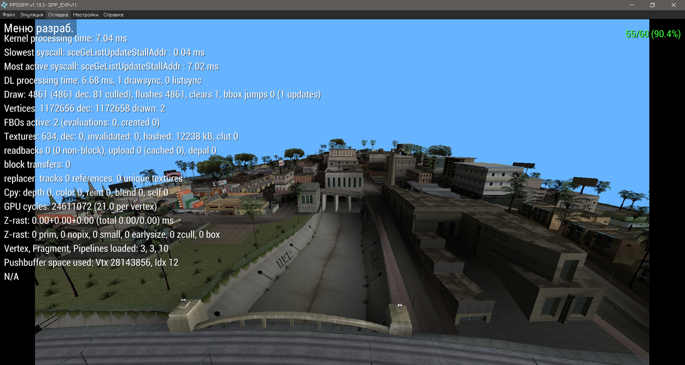

# SP-P Engine

  

*Кастомная заготовка 3D-движок для PSP (графический модуль). Ориентированный на рендеринг геометрии R* RenderWare-likely (DFF и txd в mdl и gim), с упрощённой поддержкой ipl и ide.

## 🛠 Requirements (Требования для сборки)
Для успешной компиляции проекта вам потребуется:
* Установленный **Minimalist PSPSDK** (или аналогичный тулчейн для PSP).
* Среда Windows (для запуска `.bat` скриптов).
* PSP (Fat/Slim) с кастомной прошивкой или эмулятор PPSSPP для тестов.

## 🚀 Build Instructions (Инструкция по сборке)

Проект поддерживает две конфигурации сборки: для PSP Fat (32MB RAM, 2MB VRAM) и PSP Slim (64MB RAM, 4MB VRAM).

1. Склонируйте репозиторий.
2. В корне репозитория запустите один из батников для сборки основного движка:
   * Запустите `BUILD_FAT.bat` — для сборки под PSP 1000 (Fat).
   * Запустите `BUILD_SLIM.bat` — для сборки под PSP 2000+ (Slim) с расширенной памятью.
3. Готовый файл `EBOOT.PBP` (вместе с `vramext.prx`) поместите на карту памяти PSP в папку `PSP/GAME/SPP_EXP/`.
4. В папку SPP_EXP/models копируйте предварительно подготовленные ассеты (SPP.IDE, SPP.IPL, SPP.IMG). Инструкция в соседнем репозитории SPP_MapConvertToolkit.

## 🙏 Special Thanks

Особая благодарность следующим людям и ресурсам за помощь в R&D, тестирование и советы, без которых этот проект был бы невозможен:
* **Dageron**, **aap / TheHero**, **Majestic**, **spicybung** — за помощь в реверс-инжиниринге форматов Stories.
* **gtamodding.ru форуму**, **gtaforums.com форуму** — за активное участие в разборах форматов.
* **gtamods.com**, **gtamodding.ru wiki** — за энциклопедирование и документацию форматов.
* **Старую команду SP-P Team:** Александр Тигишвили, Василий Ясенев, Егор Наимушин, Евгений Курьянов, Алексей Исааков, Vector Prospector-Uss, Стас Печенских, Назар Вичавский, Арман Турар - за поддержку и начальный вклад, в том числе тесты. Secret Porting - Project (SP-P).
* **Подписчиков Бусти и ВК за финансовую поддержку**, включая, но не ограничиваясь: **Lyubomir Antonov**, Test SPB, Яр Секрет, Chtecvlad, Вова Милевский и другие.
* **Команду Альянса СНГ разработчиков PSP** - @st1x51, @ValeraKirpich (androidandpsphl), infernumcat, включая, но не ограничиваясь - PSP R&D.
* И других людей, прямо или не очень, помогавших проекту.

## License
The core engine code is licensed under the [MIT License](LICENSE.md).

### Acknowledgements & Third-Party Code
* **VRAM Hook**: The VRAM memory unlocking hook (`VramExt`) contains code copyrighted by Crow_bar and MDave (2010).
* **PSPSDK Driver Libraries**: The `libs/` folder contains pre-compiled import libraries (`libpspimpose_driver.a`, etc.) from older, deprecated branches of the PSPSDK. They are included here solely for preservation and compilation compatibility, as their sources are currently difficult to locate.
* **Minimalist PSPSDK**: Built using the unofficial PSP Software Development Kit.

**AI Assistance**: The core architecture and logic remain human-directed. Some parts of the codebase (refactoring, assets scripts) and markdown documentation were generated/refined with the help of LLM (Gemini).
